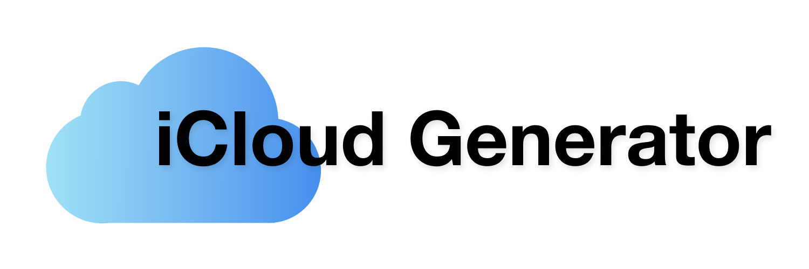
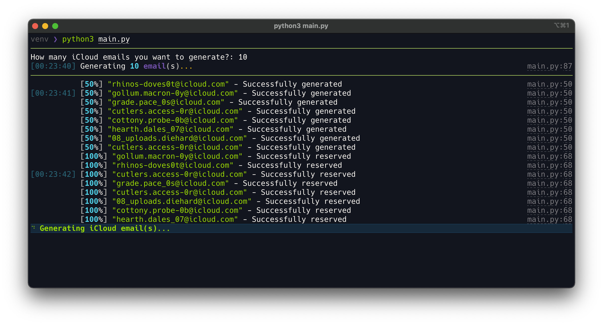
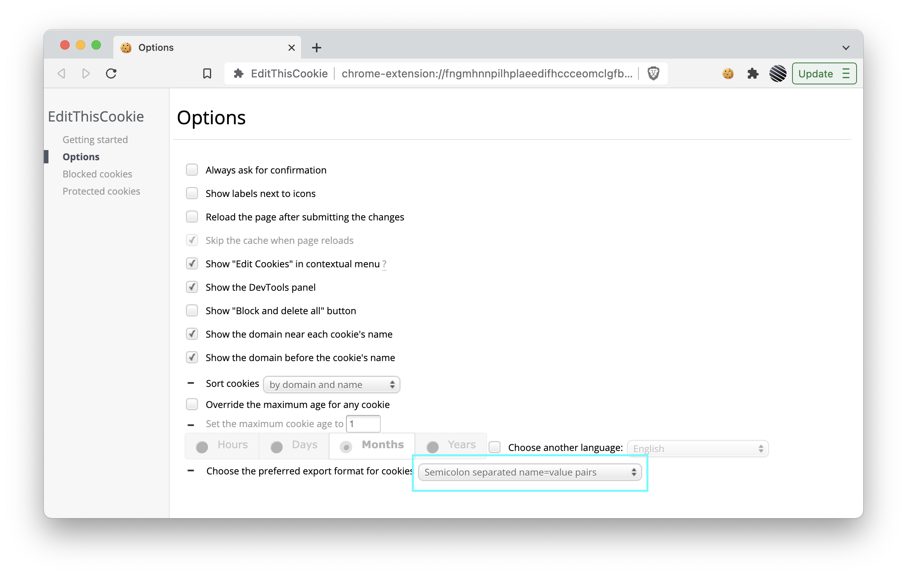
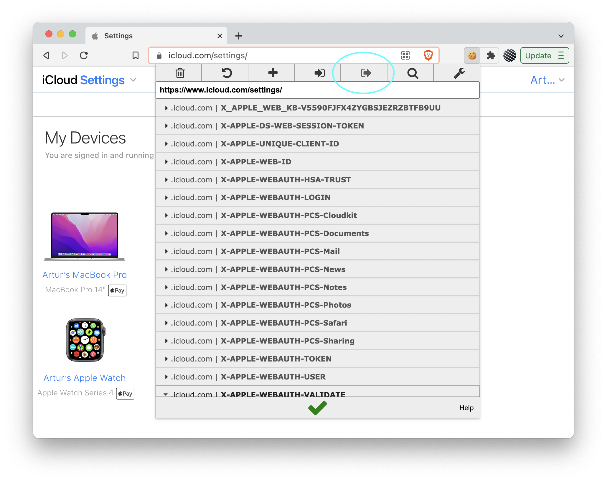

<p align="center"></p>

> Automated generation of Apple's iCloud emails via HideMyEmail.

_You do need to have an active iCloud+ subscription to be able to generate iCloud emails..._

<p align="center"></p>

## Usage

You can get prebuild binaries for Windows & ARM Macs from the [releases page](https://github.com/rtunazzz/hidemyemail-generator/releases). Follow the guide steps 1 & 2 below if you'd like to run it from source, otherwise you can skip to the 3rd step - set your cookie and run.

Apple allows you to create 5 * # of people in your iCloud familly emails every 30 mins or so. From my experience, they cap the amount of iCloud emails you can generate at ~700.

## Setup
> Python 3.12+ is required!

1. Clone this repository

```bash
git clone https://github.com/rtunazzz/hidemyemail-generator
```

2. Install requirements

```bash
pip install -r requirements.txt
```

3. [Save your cookie string](https://github.com/rtunazzz/hidemyemail-generator#getting-icloud-cookie-string)

   > You only need to do this once 🙂

4. You can now run the gen with:


**on Mac:**

```bash
python3 main.py
```

**on Windows:**

```bash
python main.py
```

## Getting iCloud cookie string

> There is more than one way how you can get the required cookie string but this one is _imo_ the simplest...

1. Download [EditThisCookie](https://chrome.google.com/webstore/detail/editthiscookie/fngmhnnpilhplaeedifhccceomclgfbg) Chrome extension

2. Go to [EditThisCookie settings page](chrome-extension://fngmhnnpilhplaeedifhccceomclgfbg/options_pages/user_preferences.html) and set the preferred export format to `Semicolon separated name=value pairs`

<p align="center"></p>

3. Navigate to [iCloud settings](https://www.icloud.com/settings/) in your browser and log in

4. Click on the EditThisCookie extension and export cookies

<p align="center"></p>

5. Paste the exported cookies into a file named `cookie.txt`

You may also paste a browser "Copy as cURL" capture into `cookie.txt`; the
loader accepts both formats and uses the latest authenticated `-b/--cookie`
block. If the generator reports `Invalid global session`, capture a fresh
request whose URL contains `maildomainws` or `/v1/hme`/`/v2/hme` while the
iCloud page is open. A static page request can return HTTP 200 while its
session token is no longer accepted by the Hide My Email service.

## Automatic Cookie refresh on Windows

This project includes `refresh_cookie.py`. It launches a persistent Edge
profile, reads the current iCloud browser session, validates it against the
iCloud setup service, and atomically updates `cookie.txt`. Cookie values are
never printed by the script, and an unsuccessful refresh keeps the old file.
The default profile is the isolated directory
`hidemyemail-generator\data\browser-profile-independent`, so it does not lock
the user's normal Edge profile.

Install the updated requirements and initialize the dedicated browser profile:

```powershell
hidemyemail-generator\.venv\Scripts\python.exe -m pip install -r hidemyemail-generator\requirements.txt
hidemyemail-generator\.venv\Scripts\python.exe hidemyemail-generator\refresh_cookie.py --headed
```

The same setup can be started by double-clicking the root-level
`refresh_cookie.bat`.

Complete iCloud sign-in/verification in the opened window once. Later runs of
`icloud-code-api\generate_and_import.py` refresh the session automatically
before generating aliases. The scheduled task uses headless mode; when Apple
keeps the session cookie as a session-only browser cookie, it validates and
reuses the already refreshed `cookie.txt` instead of replacing it with an
empty headless capture.

For the least manual work, keep the isolated browser session alive between
generation runs:

```powershell
.\install_hme_browser_session.bat
```

This registers a per-user logon task and starts a dedicated Edge window that
checks the session every five minutes. It does not use or lock the normal
Edge profile. You can also run `keep_cookie_session.bat` directly. Remove the
logon task with `uninstall_hme_browser_session.bat`.

Apple can still invalidate a session or require a new verification. When that
happens the isolated window stays available and the keep-alive task continues
checking until you finish the one required verification. The current state is
written to:

```text
hidemyemail-generator\data\browser-session-status.json
hidemyemail-generator\data\browser-session.log
```

The local admin dashboard also displays this status. A successful login is
reused automatically by the generator and by the 30-minute scheduled job.
The workflow does not store an Apple password or attempt to bypass Apple's
password/2FA checks; if Apple invalidates the session, one interactive
verification is still required.

If the normal Edge profile is already logged in, close Edge completely and run
the following once instead of using the dedicated profile:

```powershell
hidemyemail-generator\.venv\Scripts\python.exe hidemyemail-generator\refresh_cookie.py --use-existing-profile --headed
```

For a different profile or browser, set `HME_BROWSER_PROFILE`, `HME_BROWSER`
(`msedge`, `chrome`, or `chromium`), and optionally
`HME_BROWSER_PROFILE_DIRECTORY`. Use `--no-cookie-refresh` on
`generate_and_import.py` only when manually maintaining `cookie.txt`.

# License

Licensed under the MIT License - see the [LICENSE file](./LICENSE) for more details.

Made by **[rtuna](https://twitter.com/rtunazzz)**.
